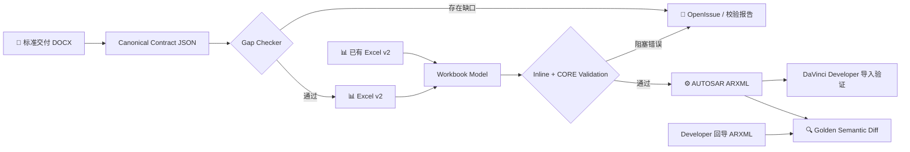

<div align="center">

# Generate-Arxml

**DOCX / Excel-driven AUTOSAR Classic ARXML generation and validation**

将可规则化的 SWC 与 Composition 建模，从人工录入转为可审查、可校验、可重复执行的离线生成链路。

[](https://www.python.org/)
[](#-当前能力边界)
[](#-路线图)
[](LICENSE)

[快速开始](#-快速开始) · [工作流](#-工作流) · [能力边界](#-当前能力边界) · [项目文档](#-项目文档) · [Codex Skill](#-codex-skill)

</div>

> [!IMPORTANT]
> 本项目面向 **AUTOSAR Classic 应用层可规则化建模自动化**。当前目标是减少 DaVinci Developer 中重复、易错的手工录入；它不是 ECUC、RTE、BSW 或完整商业工具链的替代品。最终交付仍应结合项目约束，并在目标 DaVinci Developer 工作区中验证。

## ✨ 为什么做这个项目

传统接口交付经常经历多次人工转录：

```text
SRD / 详设 → 交付文档 → Excel → Developer 手工建模 → ARXML
```

命名、数据类型、Enum 初值、Record 字段、Runnable Access 和 Connector 都可能在转录中遗漏。Generate-Arxml 将这些决策放进可追溯的中间模型，并在生成前主动暴露缺口。

| 可追溯 | 可校验 | 可回归 |
|:---:|:---:|:---:|
| DOCX 字段进入 canonical contract | OpenIssue、内联校验和 CORE rules | 与 Developer 回导 ARXML 做语义 diff |
| 保留显式、推导、默认和缺失状态 | 错误存在时阻止最终 ARXML | 忽略 UUID、时间戳和无关排序 |

## 🔄 工作流



核心原则：**缺失信息进入报告，不由工具静默编造；阻塞错误未解决，不交付最终 ARXML。**

## 🚀 快速开始

### 环境要求

- Windows + PowerShell
- Python 3.10 或更高版本
- 首次安装依赖需要网络；依赖安装完成后，文档解析、Excel 转换、校验和 ARXML 生成均可离线运行

```powershell
git clone https://github.com/dandanhuang1214-ops/Generate-Arxml.git
cd Generate-Arxml

py -3 -m venv .venv
.\.venv\Scripts\python.exe -m pip install -e ".[dev]"
```

验证环境：

```powershell
.\.venv\Scripts\python.exe -c "import arxml_codegen, docx, lxml, openpyxl, yaml"
.\.venv\Scripts\python.exe -m pytest
```

### 从交付 DOCX 生成

单 Atomic SWC 信号交付示例：

```powershell
.\.venv\Scripts\python.exe scripts\docx_to_contract.py `
  --input "D:\path\to\delivery.docx" `
  --contract "output\deliverables\demo\contract.json" `
  --excel "output\deliverables\demo\model.xlsx" `
  --issues "output\deliverables\demo\issues.md" `
  --report-json "output\deliverables\demo\issues.json" `
  --arxml "output\deliverables\demo\generated.arxml" `
  --generation-report "output\deliverables\demo\generation_report.md" `
  --mode signal `
  --profile signal_atomic_davinci
```

> [!NOTE]
> 命令返回 `1` 不一定表示程序崩溃。存在未关闭的 OpenIssue、模型错误或 CORE `ERROR` 时，工具会保留 contract、Excel 和报告，并主动跳过最终 ARXML 生成。

### 从已有 Excel 生成

先用当前代码创建 22 Sheet 模板（不要复制旧样例工作簿作为新项目起点）：

```powershell
.\scripts\run_codegen.ps1 -CreateTemplate data/input/my_template.xlsx
```

先 dry-run，再正式生成：

```powershell
.\scripts\run_codegen.ps1 -Config config/project.yaml -DryRun
.\scripts\run_codegen.ps1 -Config config/project.yaml
```

也可以使用 CMD 入口：

```bat
scripts\run_codegen.cmd
```

## 📦 生成物

推荐每个项目使用独立交付目录：

```text
output/deliverables/<project>/
├─ contract.json           # canonical 交付契约
├─ model.xlsx              # Excel v2 中间模型与审查面
├─ issues.md               # 人工可读缺口报告
├─ issues.json             # 机器可读缺口报告
├─ generated.arxml         # 校验通过后生成
└─ generation_report.md    # 最终生成和校验摘要
```

Golden 对比结果建议放在：

```text
output/validation/<project>/
├─ golden_diff.md
└─ golden_diff.json
```

完整目录约定见 [docs/output_directory.md](docs/output_directory.md)。`output/` 是本地生成区，不应提交到 Git。

## 🧭 两种主要 Profile

| Profile | 适用输入 | 当前范围 |
|---|---|---|
| `signal_atomic_davinci` | 单 Atomic SWC、纯信号交付 | S/R Interface、端口、Runnable、Access、数据类型与初值 |
| `mixed_signal_soa` | 多 SWC、信号与服务混合交付 | S/R、基础同步 C/S、Record、Composition 与 Connector |

DOCX 的目标不是复制全部 Excel 字段。上游只提供无法可靠推导的业务事实，工具负责构造包路径、引用、默认映射和标准生成结构。

## 🧩 当前能力边界

| 建模能力 | 状态 | 说明 |
|---|:---:|---|
| Primitive ADT / IDT / DataTypeMapping | ✅ | 基础类型与显式映射 |
| IDENTICAL / LINEAR / TEXTTABLE | ✅ | 含 Rational Coefficients 和 Enum 文本映射 |
| DataConstr / Unit | ✅ | 支持当前项目使用的基础形式 |
| Record / 嵌套 Record | ✅ | ADT、结构 IDT 和递归字段 |
| 嵌套 Record 初值 | ✅ | 递归 `RECORD-VALUE-SPECIFICATION` |
| Nonqueued S/R | ✅ | Sender/Receiver、ComSpec、初值和 Access |
| 同步 C/S | ✅ | 基础 Operation、参数和调用关系 |
| 单层 Composition | ✅ | ComponentPrototype、Assembly 和基础 Delegation |
| Queued S/R | 🟡 | Excel 层有基础字段，DOCX 闭环尚未完整开放 |
| 复杂 ComSpec / Filter | 🟡 | 仅覆盖当前已验证子集 |
| 异步 C/S | ⬜ | 尚未实现 |
| ModeSwitch / Mode Event / Disabling | ⬜ | 尚未实现 |
| 多层 Composition | ⬜ | 尚未实现 |
| E2E / SecOC / NvM 详细配置 | ⬜ | 不在当前阶段范围 |
| ECUC / OS 与 RTE Task Mapping | ⬜ | 不在当前阶段范围 |
| SOME/IP Deployment / Service Discovery | ⬜ | 不在当前阶段范围 |

`✅ 已支持` 不等于覆盖 AUTOSAR 的所有变体，而是代表当前项目模型、校验和测试已经覆盖该基础链路。

## 🛡️ 校验与 DaVinci 兼容性

| 验证层级 | 作用 | 能否单独证明 Developer 可导入 |
|---|---|:---:|
| XML / namespace 解析 | 检查 XML 基本结构 | 否 |
| `validate_model_v2` | 检查必填项、引用、类型和组件结构 | 否 |
| CORE rules | 检查数据类型、端口、Runnable、Connector 和命名语义 | 否 |
| Golden semantic diff | 对比 ComSpec、InitValue、CompuMethod、DataConstr 等结构 | 部分 |
| DaVinci Developer 实际导入 | 在目标工具和 Workspace 中验收 | **是** |

运行 golden diff：

```powershell
.\.venv\Scripts\python.exe scripts\diff_against_golden.py `
  --generated "output\deliverables\demo\generated.arxml" `
  --golden "output\references\demo\developer_export.arxml" `
  --report "output\validation\demo\golden_diff.md" `
  --json "output\validation\demo\golden_diff.json"
```

## 🗂️ 项目结构

```text
Generate-Arxml/
├─ src/arxml_codegen/    # Contract、Excel Reader、模型、Writer和Validator
├─ scripts/              # DOCX/Excel入口、模板生成和golden diff
├─ config/               # 项目级生成配置
├─ data/input/           # Excel输入与标准模板
├─ docs/                 # 交付规范、字段规则和操作文档
├─ skills/               # 可共享的Codex操作Skill
├─ tests/                # 正向、反向和回归测试
└─ output/               # 本地生成物（Git忽略）
```

Excel v2 当前模板定义覆盖 22 个建模 Sheet。仓库中的旧样例工作簿可能仍是较早版本；应通过当前 CLI 创建新模板。完整字段、约束和示例见 [Excel模板说明](docs/excel_template.md)，不在 README 中重复展开。

## 📚 项目文档

| 文档 | 用途 |
|---|---|
| [交付文档固定链路](docs/delivery_contract_workflow.md) | DOCX → contract → Excel → ARXML 的总体流程 |
| [Excel模板说明](docs/excel_template.md) | 22 Sheet 字段和填写规则 |
| [信号Atomic离线操作手册](docs/signal_atomic_davinci_offline_manual.md) | 信号链路命令与交付步骤 |
| [输出目录规范](docs/output_directory.md) | deliverables、validation、references 等目录用途 |
| [项目结构](docs/project_structure.md) | 代码架构和模块职责 |
| [路线图](docs/roadmap.md) | 当前阶段和后续计划 |
| [DaVinci Developer与AUTOSAR CP中文手册](docs/davinci_developer_autosar_cp_handbook_zh.md) | 独立学习资料，不属于生成链路 |

交付模板：

- [信号驱动模板 v1.2](docs/signal_delivery_template_v1.2.docx)
- [混合信号/SOA模板 v1.7](docs/mixed_signal_soa_delivery_template_v1.7.docx)

## 🤖 Codex Skill

仓库包含可共享的 [`generate-autosar-arxml`](skills/generate-autosar-arxml/SKILL.md) Skill，用于让 Codex 或其他已安装该 Skill 的 Agent 按固定流程操作本项目。

```text
使用 $generate-autosar-arxml 检查这份交付文档，
先输出缺口报告；校验通过后再生成可导入 Developer 的 ARXML。
```

Skill 只负责编排项目操作、执行校验和解释生成报告，不包含 AUTOSAR 教学内容，也不会替代项目中的确定性 Python 规则。

## 🧪 开发与测试

```powershell
# 全量测试
.\.venv\Scripts\python.exe -m pytest

# 静态检查
.\.venv\Scripts\python.exe -m ruff check .

# 查看CLI
.\.venv\Scripts\python.exe -m arxml_codegen.cli --help
.\.venv\Scripts\python.exe scripts\docx_to_contract.py --help
```

核心实现：

- `src/arxml_codegen/contract/`：DOCX、canonical contract 和 Excel Builder
- `src/arxml_codegen/excel/`：Excel v2 Reader 与模板
- `src/arxml_codegen/generator/`：ARXML Writer
- `src/arxml_codegen/validator/`：内联与 CORE 校验

## 🛣️ 路线图

| 阶段 | 状态 |
|---|:---:|
| 纯信号 Atomic SWC 基础闭环 | ✅ 已完成 |
| 混合信号 / 同步 C/S / Composition | 🚧 开发与实车案例验证中 |
| Queued S/R 和更多 ComSpec | 📋 计划 |
| ModeSwitch 与 Mode Events | 📋 计划 |
| 文档抽取 Human-in-the-loop / LangChain 工作流 | 📋 后续阶段 |

路线图会以真实 DaVinci Developer 导入结果和 golden regression 为验收依据，而不是只以 XML 能够生成为完成标准。

## ⚖️ 声明

本项目是独立开源工程，与 AUTOSAR、Vector Informatik 或 DaVinci Developer 无隶属、授权或背书关系。AUTOSAR、Vector 和 DaVinci 是其各自权利人的商标。使用者应依据目标 AUTOSAR 版本、OEM规范和商业工具链对生成物进行最终验证。

## 📄 License

本项目使用 [Apache License 2.0](LICENSE)。
